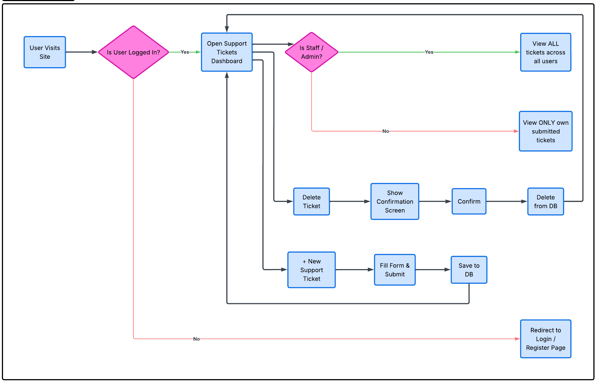

**Author:** Mlamleli Ngobese
**Portfolio Project:** Project Portfolio 4 (Full-Stack Toolkit)

# TicketSync

TicketSync is a full-stack Django issue tracking and support ticketing system deployed on Heroku. The application allows users to create, view, edit, and delete support tickets through an intuitive web interface.

👉 **[Live Deployed Application on Heroku](https://ticketsync-257c307d6ac3.herokuapp.com/)**

---

## Design & User Experience (UX)

## Agile Development & User Stories

This project was developed following Agile methodologies and tracked using a GitHub Projects Kanban board.

👉 **[TicketSync GitHub Project Board](https://github.com/users/mlamleli85/projects/5)**

### Epic: Implementation of the Support Ticket System

User stories were prioritized using MoSCoW categorization (`Must-Have`, `Should-Have`, `Could-Have`) and tracked from backlog to completion:

- **Epic:** Implementation of the Support Ticket System
- **[Must-Have]** As a user, I can submit a support ticket so that I can get help with my issue
- **[Should-Have]** As a user, I can see a success confirmation message so that I know my ticket was sent
- **[Could-Have]** As an admin, I can view submitted tickets in the dashboard so that I can resolve user issues

### Logic Flowchart

The chart below outlines the user flow, authentication logic, and CRUD action loops designed for TicketSync:

---

## Features & CRUD Capabilities

The application implements full front-end CRUD (Create, Read, Update, Delete) functionality for managing support tickets:

- **Create:** Users can submit new support tickets via a dedicated front-end form (`/submit/`).
- **Read:** Users can view the complete list of open/closed tickets (`/`) and click into individual ticket detail pages (`/<id>/`).
- **Update:** Users can edit existing ticket details or update statuses (`/<id>/edit/`).
- **Delete:** Users can delete or close support tickets (`/<id>/delete/`).

---

## Manual Testing Summary

| Feature / Action       | Test Procedure                                                     | Expected Outcome                                      | Result   |
| :--------------------- | :----------------------------------------------------------------- | :---------------------------------------------------- | :------- |
| **Create Ticket**      | Navigate to `/submit/`, fill out form with valid data, and submit. | Ticket is created; user redirected to list view.      | **Pass** |
| **Read Ticket List**   | Navigate to root URL (`/`).                                        | List of existing tickets displays clearly.            | **Pass** |
| **Read Ticket Detail** | Click on an individual ticket from the list.                       | Navigates to `/<id>/` showing full details.           | **Pass** |
| **Update Ticket**      | Navigate to `/<id>/edit/`, modify fields, and submit.              | Ticket updates in database and reflects on front-end. | **Pass** |
| **Delete Ticket**      | Click delete on `/<id>/delete/` page.                              | Ticket is permanently removed from list and database. | **Pass** |
| **Admin Access**       | Access `/admin/` and log in with superuser credentials.            | Grants full administrative dashboard access.          | **Pass** |

---

## Code Validation

### Python Validation (PEP8)

All custom Python code was validated using the Code Institute Python Linter (PEP8 compliance).

- **`tickets/models.py`**: No errors found.
- **`tickets/views.py`**: No errors found.
- **`tickets/forms.py`**: No errors found.
- **`tickets/urls.py`**: No errors found.
- **`core/settings.py`**: Validated; long lines auto-generated by Django (e.g., `AUTH_PASSWORD_VALIDATORS`) were kept for framework compatibility.

## Bugs & Debugging

### Solved Bugs

1. **Static Files 404 in Production:**
   - **Issue:** Static CSS/JS files were not serving on the live Heroku deployment.
   - **Cause:** Heroku does not natively serve static files without specific configuration.
   - **Fix:** Installed and configured `WhiteNoise` in `settings.py` and `middleware` to handle static asset delivery.

2. **Unwanted Dark Background on Exported Diagram:**
   - **Issue:** Exporting the UX flowchart with transparency rendered a solid black background when viewed on dark-themed image viewers.
   - **Fix:** Re-exported the diagram with an explicit solid white canvas background and cropped unnecessary items before linking to docs.

### Known / Unfixed Bugs

- No known bugs or open issues remain in the deployed application at the time of submission.

## Deployment

The project was deployed to Heroku using the following steps:

1. Configured Django settings for production (`ALLOWED_HOSTS`, database configuration via `dj-database-url`).
2. Configured dynamic static file serving using `WhiteNoise`.
3. Created a `Procfile` specifying the `gunicorn` web server executable.
4. Linked the GitHub repository to Heroku and ran database migrations via `heroku run python manage.py migrate`.
5. Created a superuser via `heroku run python manage.py createsuperuser`.

---

## Tech Stack

- **Backend:** Python, Django
- **Database:** PostgreSQL (Heroku Postgres)
- **Web Server:** Gunicorn, WhiteNoise
- **Deployment Platform:** Heroku

---

## Unfixed Bugs

- No known bugs or open issues remain in the deployed application at the time of submission.
